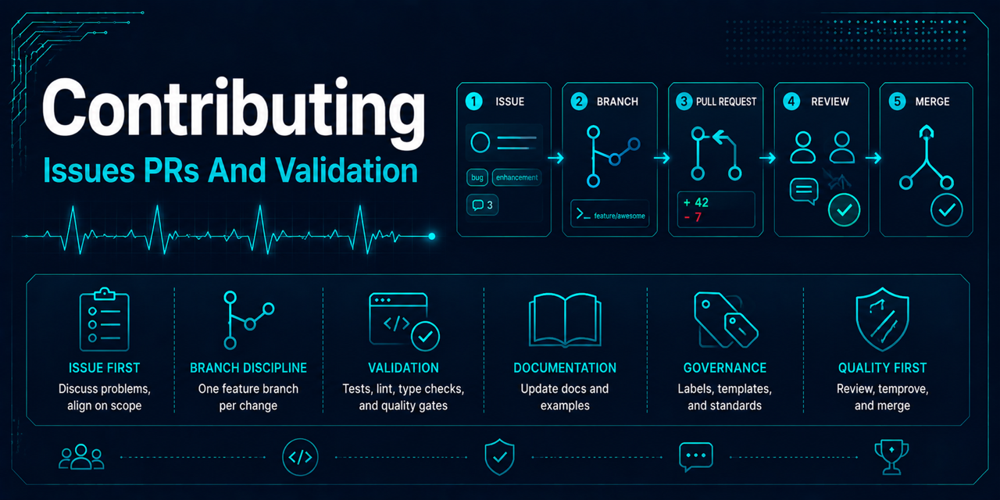

# Contributing



This repository is a historical educational ECG machine-learning project under incremental
modernization. Contributions should improve its value as a reproducible data-engineering case
study without implying that it is medical software or clinically validated.

## Before starting

- Read the [documentation index](docs/README.md) and
  [modernization roadmap](docs/modernization-roadmap.md).
- Keep the preserved `archive/original_2022/` bundle unchanged unless a dedicated archival repair
  is proposed and reviewed.
- Do not commit source ECG records, derived patient-level data, credentials, generated models, or
  unreviewed third-party images.
- Introduce supported behavior and its tests together.

## Local workflow

Create the locked environment and install the commit hooks:

```fish
uv sync --locked --dev
uv run pre-commit install --install-hooks
```

This installs only core runtime and repository engineering dependencies. Use the documented
[environment workflows](docs/environment-reproducibility.md) for notebook or optional experiment
work; do not add those packages to `dev` or install them globally.

Create a focused branch from current `main`:

```fish
git switch main
git pull --ff-only origin main
git switch -c feature/short-description
```

Before opening a pull request, run:

```fish
uv run pytest
uv run pyright
uv run pre-commit run --all-files
git diff --check
```

Dataset commands must target ignored local paths. Generated manifests belong under `artifacts/` and
must not be staged with source changes.

## Pull request expectations

A pull request should:

- explain what changed, why it changed, and how it was validated;
- remain small enough to review as one coherent modernization step;
- distinguish implemented behavior from proposed architecture;
- document new configuration, generated artifacts, and data contracts;
- preserve dataset attribution and the non-clinical use limitation;
- update `CHANGELOG.md` under `## Unreleased` when it changes substantive paths
  (`src/`, `scripts/`, `docs/`, `configs/`, `.github/workflows/`) -- enforced by
  the `Enforce per-PR changelog updates` CI job; a pull request that genuinely
  needs no entry declares a `changelog: not-needed -- <reason>` line in its body
  instead (see [release governance](docs/governance/releases.md)); and
- update the roadmap or status documentation when a capability materially changes.

Any new data workflow should record source version, checksums, configuration, code revision,
schema version, row counts, and record-level split membership. Tests must use synthetic fixtures or
inputs with explicit redistribution permission.

## Executor prompts and durable contracts

All executor task specifications (`prompts/*.md`) must begin with an explicit instruction to read and follow durable contracts:
CLAUDE.md, AGENTS.md, CONTRIBUTING.md, memory files, and GOVERNANCE.md.

This ensures every executor session reads the latest contracts before proceeding. Executor prompts are
task-specific and can become stale; durable contracts live in version control and evolve with the project.

## Post-merge closure pass

After a pull request is squash-merged via GitHub GUI, perform the following automated cleanup
(this is a standing contract, not a one-off ask):

1. **Verify merge and issue closure:** Confirm the PR shows as `MERGED` and all linked issues
   (referenced as `Fixes #N` in the commit message) are `CLOSED`.

2. **Pull main locally:** Fetch and fast-forward your local `main` to match `origin/main`.

   ```fish
   git fetch origin
   git switch main
   git pull --ff-only origin main
   ```

3. **Delete merged branches:** Prune remote tracking and delete the local topic branch.

   ```fish
   git fetch --prune
   git branch -D <branch-name>  # Use -D (not -d) because squash merges break ancestry checks
   ```

4. **Preserve session artifacts (if using worktrees):** Before removing a worktree, copy any
   files under `artifacts/walkthroughs/` and `artifacts/session-handoffs/` to the primary checkout.

5. **Produce PM handoff (if applicable):** When the work originated from a PM/spec thread, produce
   a brief handoff extract (what merged, PR/issue numbers, what's next).

6. **Verify clean state:** Run `git status` to confirm the working tree is clean and session
   artifacts are gitignored.
