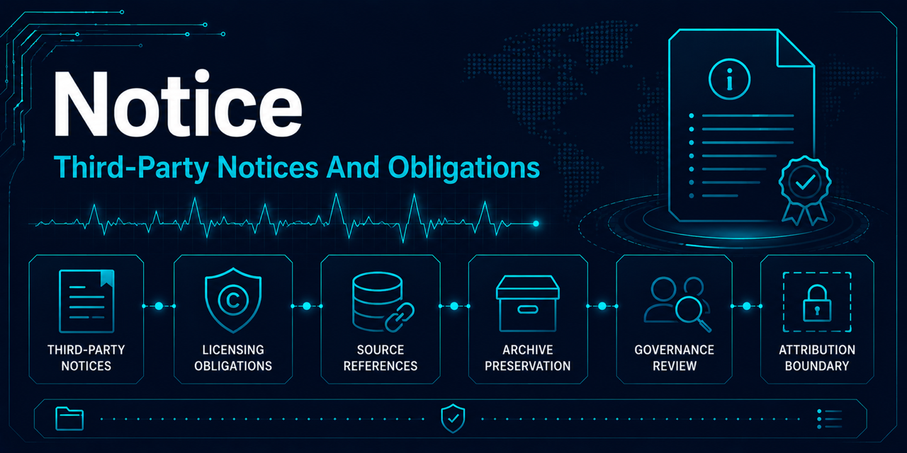

# Third-party notices and attribution status

This repository contains project code, public-dataset references, and historical presentation materials. The root MIT license applies only to material owned by this repository's author.

## MIT-BIH Arrhythmia Database

The source dataset is distributed separately by PhysioNet under the Open Data Commons Attribution License v1.0. It is not included in this repository. See [data provenance](docs/data-provenance.md) for source, license, DOI, and citations.

## WFDB and Python dependencies

The supported package and development dependencies are declared in `pyproject.toml` and resolved in
`uv.lock`. They remain subject to their respective licenses; the repository's MIT license does not
relicense them. Dependencies used only by the archived 2022 notebooks are historical references and
are not part of the supported modern environment.

The supported runtime currently uses NumPy for typed array contracts and WFDB for local signal and
annotation file access. Their inclusion does not transfer ownership of the source dataset or imply
endorsement of this project for clinical use.

## Historical tutorial influence

`archive/original_2022/wrangle.py` identifies the Towards Data Science article "Detecting Heart Arrhythmias with Deep Learning in Keras" (Andrew Long) as sample code used while developing the original dataset workflow. The source file retains the original article URL.

An adaptation-extent audit is complete; see [`archive/original_2022/PROVENANCE.md`](archive/original_2022/PROVENANCE.md#code-provenance-evidence) for the comparison method and evidence. `wrangle.py`'s `load_ecg`, `make_dataset`, and `build_XY` functions, its `pts`/`nonbeat`/`abnormal` lists, and its `num_sec`/`fs` parameters are directly adapted from the cited article's linked source notebook, with only cosmetic formatting differences (docstrings versus inline comments, PEP 8 spacing). `wrangle.py`'s `split_my_data` function is not adapted from that source: the source notebook splits by patient identity (`random.sample(pts, 36)`), while `split_my_data` performs an ordinary beat-level `train_test_split`, independent of the cited article's approach.

## Images and notebook research material

The `archive/original_2022/images/` directory and historical notebooks contain diagrams, photographs, and background material assembled for the original educational presentation. Their authorship and reuse terms are not consistently recorded.

An attribution audit is complete; see [`archive/original_2022/ATTRIBUTION.md`](archive/original_2022/ATTRIBUTION.md) for the per-file inventory and [`archive/original_2022/PROVENANCE.md`](archive/original_2022/PROVENANCE.md) for the audit method and evidence. Of the 16 images audited, 7 are attributed to a specific external source (Christopher Olah's "Understanding LSTM Networks"), 2 are assessed as author-original, and 7 remain of unresolved provenance — disclosed explicitly rather than guessed at.

Regardless of attribution status:

- do not assume those assets are covered by the repository's MIT license;
- do not reuse them in new publications or generated documentation;
- retain them only as historical project material; and
- prefer replacement figures generated directly from appropriately licensed data.

The archive's [preservation policy](archive/original_2022/README.md#preservation-policy) excludes replacing or removing archived images. Attribution documentation, not replacement, is how this repository closes the gap for imagery that predates the modernization.

## Documentation banner images

The three banner images in `docs/assets/` (`ecg-readme-project-overview-banner.png`, `ecg-first-time-environment-setup-banner.png`, `ecg-notebook-workflow-banner.png`) are AI-generated original assets created specifically for this project's modernization documentation. They are not third-party material and are unrelated to the unresolved-provenance imagery described above under "Images and notebook research material."
