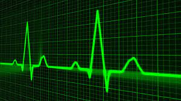

# ECG Anomaly **Detection**

This repository contains the files for Jared Godar's Codeup project on anomaly detection in ECG data.

---

## About the project

The improvement in availability and reduction in cost of a variety of sensors have lead to an increased need for automatic signal processing and analysis of the increased data generated.

Real-world anomaly detection for time series is still a challenging task. This is especially true for periodic or quasi-periodic time series since automated approaches have to learn long-term correlations before they are able to detect anomalies.

This project will look at detecting anomalies in electrocardiogram (ECG) signals.

Until recently, most ECGs were performed in a clinical setting. They were ordered by a healthcare professional and one was on hand to analyze and interpret the results.

Now, many consumer wearable devices are able to measure ECGs outside of a clinical setting. It is important to be able to quickly and accurately determine abnormalities in these measurements in an automated manner.

### Project goals

The goal of this project is to detect anomalies in ECG measurements.

It is necessary to detect these anomalies in an automated way in order to maximize the benefit of increased access to ECG measurements.

### Project Description

This project provides the opportunity to create and evaluate multiple predictive models as well as implement other essential parts of the data science pipeline.

I have pulled ECG data from an online repository (https://physionet.org/content/mitdb/1.0.0/) and used this data to generate 6-second time windows centered on individual heartbeats. These data were split into train, validate, and test sets. Many random forrest models were created and evaluated using a variety of testing metrics, with a focus on sensitivity as this focuses on clinically-relevant false negative predictions. That is to say, it is important that our model not tell you everything is fine when you actually have a heart condition.

While many different features of the ECGs were annotated, I disregarded annotations that did not pertrain to the actual features of the heartbeat and I added a boolean column which contains a 0 for normal beats and a 1 for abnormal beats, regardless of the typr of abnormality.

### Initial questions?

- What do normal heartbeats looks like?
- What do abnormal heartbeats look like?

### Data Dictionary

The data are arranged with individual observations falling into rows not columns. The values in each cell represent the ECG signal intensity at that time point and each column is a signal reading sampled at 360 Hz. The 2160 columns represent a 6-second window of ECG data.

| Feature                    | Datatype               | Description                                                           |
|:---------------------------|:-----------------------|:----------------------------------------------------------------------|
abnormal                  |          bool       | 0 for normal heartbeat, 1 for abnormal heartbeats 
sym | object | Code representing specific type of abnormality

### Steps to Reproduce

- [x] Read this README.md
- [ ] Download the data from https://physionet.org/static/published-projects/mitdb/mit-bih-arrhythmia-database-1.0.0.zip
- [ ] Download  `wrangle.py` into your working directory.
- [ ] Ensure that the `data_path` in the `wrangle.py` file corresponds to the location you downloaded the data.
- [ ] Run the `report.ipynb` workbook.

---

### The Plan

1. **Acquire, clean, prepare, and split the data.**
    - This was the third dataset I attempted working with. The first had already manipulated the raw data more than I wanted, the second was thousands of individual matlab files, and this dataset seemed to have everything I needed in an accessible format.
2. **Exploratory data analysis:**
   - There weren't a lot of 'features' for this data for exploration
   - The data were primally time-series signal intensity over time for the electrical signature of heartbeats along with a data labeling abnormalities.
   - I can plot and look at what normal beats look like and what abnormal beats look like.
3. **Model generation, assessment, and optimization:**
   - I will be using a variety of random forest models
   - Tune hyperparameters with a look at acccuracy and specificity as metrics to optimize.
   - Calculate evaluation metrics to assess the quality of models
   - Perform evaluation on out-of-sample validate data to look for overfitting
   - Select highest performing model
   - Test that model with the previously unused and unseen test data once and only once.
  4. **Next Steps/Recommendations:**
    - Continue tuning hypeparameters
    - Use neural networks for predictions
      - Autoencoders
      - Long-Short-Term-Memory (LSTM) Recurring Neural Networks (RNNs)
    - Build model out into production application that can take in ECG data and make predictions.

# Key Findings

I was able to predict abnormalities with over 95% accuracy (nearly a 40% improvement from baseline) with a false positive rate of 0.2% and false negative rate of 14.5%. Most of the false negatives were from either atrial premature beats or right bundle block beats, so further refinement and optimization will focus on those areas.