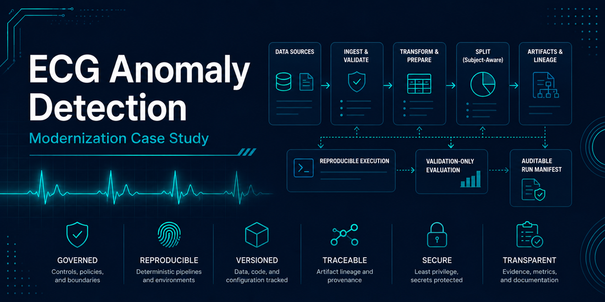

# ECG Data Pipeline Modernization

[](https://github.com/Jared-Godar/ecg_anomaly_detection/actions/workflows/quality.yml)
[](LICENSE)
[](pyproject.toml)



> A historical ECG machine-learning project being modernized into a reproducible, auditable data-engineering case study.

This repository preserves a 2022 educational experiment built on the public MIT-BIH Arrhythmia Database and incrementally replaces its notebook-bound workflow with tested package boundaries, versioned configuration, explicit lineage, and subject-aware data preparation.

The repository is at its [`v1.0.0` release](https://github.com/Jared-Godar/ecg_anomaly_detection/releases/tag/v1.0.0). See the [changelog](CHANGELOG.md) for what shipped.

## Important use limitation

This project is for research, education, and software-engineering demonstration only. It is not medical software, has not been clinically validated, and must not be used for diagnosis, monitoring, treatment, or patient-care decisions.

The labels are simplified reference-annotation classes from a historical dataset. Model output from this project does not establish whether a person has a medical condition.

## Project at a glance

| Question | Answer |
|---|---|
| **What is this?** | A responsible modernization of a notebook-oriented ECG classification project into a configuration-driven local data pipeline. |
| **Why modernize it?** | The original work used absolute paths, an unrecorded environment, and random beat-window splits that cannot establish generalization to unseen patients. |
| **What is implemented?** | Reproducible setup, acquisition, subject-aware preparation, deterministic baseline training, validation-only metrics, orchestration, and run manifests. |
| **What comes next?** | A separately reviewed protected test-partition evaluation. No supported modern benchmark exists yet. |

## Engineering capabilities demonstrated

| Capability | Evidence in this repository |
|---|---|
| Reproducible development | Python 3.12/3.13 project metadata, committed `uv` lockfile, and documented Fish-compatible workflow |
| Data provenance and integrity | Versioned PhysioNet acquisition, expected-file inventory, SHA-256 evidence, and explicit trust boundaries |
| Data contracts | Structural signal and annotation validation, closed-world label mapping, and versioned window geometry |
| Leakage-aware preparation | Deterministic subject-aware splits with assertions that subjects and records do not cross partitions |
| Lineage and auditability | Record identity retained through transformations; run manifests capture code, environment, configuration, inputs, and artifact digests |
| Pipeline design | One configuration-driven command connects supported stages and isolates every run under a UUID |
| Testability and automation | Synthetic fixtures, unit and integration tests, CI, formatting, linting, type checks, security scans, and dependency maintenance |
| Execution visibility | Per-stage progress banners with elapsed time and artifact paths for `run-pipeline`, flushed per line so subprocess consumers (including the Step 0 notebook) see it live |
| Local artifact lifecycle management | `list-runs`/`purge-run` reclaim disk space from local run output on demand, by exact run ID only, without touching the shared dataset acquisition baseline or weakening create-only artifact guarantees |
| Interruption-tolerant local experimentation | `ExperimentTracker` checkpoints long-running hyperparameter search loops one candidate at a time, so an interruption loses at most the in-progress candidate |
| CLI usability without weakened contracts | `split-windows`/`index-dataset` accept a directory of shard artifacts as `--input`, with clear diagnostics on empty, missing, symlinked, or duplicate paths, and no change to lineage or schema behavior |
| Responsible delivery | Historical results, evaluation defects, dataset licensing, modernization status, and non-clinical limitations are documented explicitly |

## Implemented pipeline

```text
PhysioNet MIT-BIH v1.0.0
          |
          v
acquire -> inventory -> validate -> map annotations -> extract windows
                                                        |
                                                        v
                                    subject-aware split -> dataset index
                                                        |
                                                        v
                         training -> validation-only evaluation
                                      |
                                      v
                             auditable run manifest
```

The supported workflow is local and sequential. It fits a deterministic baseline on training shards and evaluates the frozen model only on validation shards. The indexed test partition remains unopened and unreported. It does not implement final test evaluation, cloud infrastructure, or distributed processing.

## Current status

| Implemented today | Not yet implemented |
|---|---|
| Locked package environment and CLI | Test-partition evaluation |
| Versioned, fail-safe dataset retrieval | Test-evaluation release policy |
| File inventory, local integrity baseline, and model card | Modern held-out benchmark |
| Typed WFDB ingestion and record validation | |
| Auditable annotation mapping and window extraction | |
| Deterministic subject-aware split manifests | |
| Model-ready index over immutable record shards | |
| Run manifests and synthetic end-to-end coverage | |
| Deterministic baseline training and validation-only tested metrics | Threshold analysis and generated figures (candidate follow-up) |
| Historical archive image attribution and provenance audit | |
| Per-stage pipeline progress reporting for `run-pipeline` | |
| Local run listing and purge helpers (`list-runs`/`purge-run`) | |
| Local experiment checkpoint, resume, and progress/ETA reporting | |
| Directory-based shard discovery for `split-windows`/`index-dataset` | |
| [Subject-grouped guarantees across paired records](docs/record-grouped-splitting.md) (e.g. 201/202) from the same source | |
| [Automated package build assurance check](docs/governance/releases.md#artifact-hygiene) (build-only, never published) | |
| [Automated curated-notebook execution checks](notebooks/README.md#validation) (synthetic data, no dataset download) | |

Cloud deployment/orchestration and cross-host runtime/resource benchmarking are intentionally out
of scope for this local, portfolio case study rather than pending gaps — see [pipeline
design](docs/pipeline-design.md#proposed-cloud-mapping) and [reproducibility
evidence](docs/reproducibility-evidence.md) for the reasoning. ROC/AUC and calibration analysis are
likewise out of scope: the baseline exposes no ranked score or predicted probability to evaluate
either against — see [known limitations](MODEL_CARD.md#known-limitations-and-residual-risks).

See the [modernization roadmap](docs/modernization-roadmap.md) for phase-level status.

## Quick start

Install [uv](https://docs.astral.sh/uv/), create the locked development environment, and run the data-independent test suite:

```fish
uv sync --locked --dev
uv run pytest
```

Core, development, notebook, and optional experiment environments are separate locked workflows.
See [local environment reproducibility](docs/environment-reproducibility.md) for the commands,
dependency ownership rules, interpreter checks, and notebook kernel setup.

Run the supported pipeline from the repository root:

```fish
uv run ecg-data run-pipeline \
  --repository-root . \
  --dataset-config configs/mitdb-v1.0.0.toml \
  --mapping-config configs/annotation-map-v1.toml \
  --window-config configs/windowing-v1.toml \
  --split-config configs/splitting-v2.toml \
  --training-config configs/training-baseline-v1.toml \
  --evaluation-config configs/evaluation-baseline-v1.toml
```

The first pipeline run retrieves the configured source files from PhysioNet into the ignored raw-data zone. Later runs verify and reuse the acquisition baseline. Generated raw, interim, processed, and run artifacts remain outside Git. See the [orchestration runbook](docs/pipeline-orchestration.md) for outputs and failure behavior.

## Architecture and documentation

| Path | Responsibility |
|---|---|
| `src/ecg_anomaly_detection/` | Installable package for acquisition through validation-only evaluation |
| `configs/` | Versioned, non-secret dataset and transformation configuration |
| `data/` | Ignored raw, external, interim, and processed data zones |
| `tests/` | Unit, integration, and synthetic end-to-end coverage |
| `artifacts/` and `reports/` | Ignored generated run evidence, models, and figures |
| `archive/original_2022/` | Preserved, unsupported historical notebooks and supporting material |
| `docs/` | Architecture, contracts, provenance, limitations, and roadmap |

Start with the [documentation guide](docs/README.md), then use these focused references:

- [Public notebook workflow](notebooks/README.md)
  - Step 0: [Environment setup and artifact generation](notebooks/00-environment-setup-and-artifact-generation.ipynb)
  - Step 1: [Narrative walkthrough](notebooks/01-narrative-walkthrough.ipynb)
  - Step 2: [Gradient boosting validation example](notebooks/02-high-performing-gradient-boosting-validation.ipynb)
- [Notebook guidance](notebooks/README.md)
- [Model card](MODEL_CARD.md)
- [Repository architecture](docs/architecture.md)
- [Pipeline orchestration](docs/pipeline-orchestration.md)
- [Data provenance and licensing](docs/data-provenance.md)
- [Historical results audit](docs/historical-results.md)
- [Development workflow](docs/development.md)
- [Local environment reproducibility](docs/environment-reproducibility.md)
- [Security policy](SECURITY.md)
- [Release governance](docs/governance/releases.md)
- [Changelog](CHANGELOG.md)
- [Modernization roadmap](docs/modernization-roadmap.md)

## Historical experiment and results

The original workflow downloaded MIT-BIH records, selected the first signal channel, created six-second windows around annotated beats, mapped selected annotations into normal and abnormal classes, randomly split individual windows, and trained random-forest classifiers. It is preserved in [`archive/original_2022/`](archive/original_2022/) as historical evidence, not as a supported reproducible workflow.

The saved 2022 notebook reports 95.3% test accuracy, 85.5% recall for the combined abnormal class, and a 0.2% false-positive rate. These are historical outputs, not validated portfolio benchmarks.

The split was performed after window creation, so windows from the same record—and potentially overlapping windows—could occur in both training and test data. The result may therefore be inflated and does not measure generalization to unseen subjects. The modern pipeline now reports validation-only subject-aware metrics, but those exploratory metrics are not a replacement benchmark or evidence of test-set generalization. No held-out test benchmark is produced.

One notebook cell also reports validation accuracy of 1.00 because it scores predictions against themselves; the separately calculated value for that model is 0.845. The confusion matrices, metric definitions, and additional caveats are documented in the [historical results audit](docs/historical-results.md).

## Dataset, attribution, and licensing

The project uses the [MIT-BIH Arrhythmia Database v1.0.0](https://physionet.org/content/mitdb/1.0.0/), hosted by PhysioNet. It contains 48 half-hour, two-channel ambulatory ECG recordings from 47 subjects, sampled at 360 Hz, with reference beat annotations.

- Dataset DOI: [10.13026/C2F305](https://doi.org/10.13026/C2F305)
- Upstream data license: [Open Data Commons Attribution License v1.0](https://opendatacommons.org/licenses/by/1-0/)
- Repository policy: source and derived patient-level data are not committed
- Citation guidance: [data provenance](docs/data-provenance.md)

The repository's [MIT License](LICENSE) applies to project code and original documentation. It does not replace the licenses or attribution requirements for the dataset, dependencies, historical images, tutorials, or other third-party material. Current attribution status is recorded in [NOTICE.md](NOTICE.md).

## Known limitations

### Data and labels

- The dataset is small and is not representative of modern deployment populations.
- The binary target collapses heterogeneous annotations and excludes others.
- A single named channel (`MLII`, resolved per record rather than by position — see
  [window extraction](docs/window-extraction.md#channel-identity-contract)) is used without a
  comparative channel-selection analysis.
- Adjacent beat-centered windows may overlap.

### Evaluation

- Historical metrics use a random beat-window split and do not demonstrate generalization to unseen patients.
- Record grouping prevents record crossover but does not guarantee subject independence when multiple records belong to one person.
- The current split balances record counts rather than target distributions.
- Validation metrics are exploratory; the indexed test partition has not been evaluated.

### Reproducibility and operations

- The archived 2022 environment and exact dependency versions were not captured.
- The supported pipeline is local and sequential; no production or cloud deployment is implemented.
- Runtime and resource evidence is produced per run but is not a cross-host benchmark.
- Some archived exploratory notebooks contain saved errors and duplicated implementation.

### Third-party material

- Historical archive image attribution and `wrangle.py` tutorial-code adaptation extent are both
  audited; see [NOTICE.md](NOTICE.md), [`ATTRIBUTION.md`](archive/original_2022/ATTRIBUTION.md),
  and [`PROVENANCE.md`](archive/original_2022/PROVENANCE.md) for per-file status, including assets
  where provenance could not be resolved. Unverified assets are not reused in new portfolio
  material.

## Citation, contribution, and license

- Cite this repository with [CITATION.cff](CITATION.cff) and cite MIT-BIH and PhysioNet separately as described in [data provenance](docs/data-provenance.md).
- Follow the Fish-compatible setup, data-safety rules, and pull-request checks in [CONTRIBUTING.md](CONTRIBUTING.md).
- Project code and original documentation are available under the [MIT License](LICENSE); datasets and third-party materials retain their own terms.
