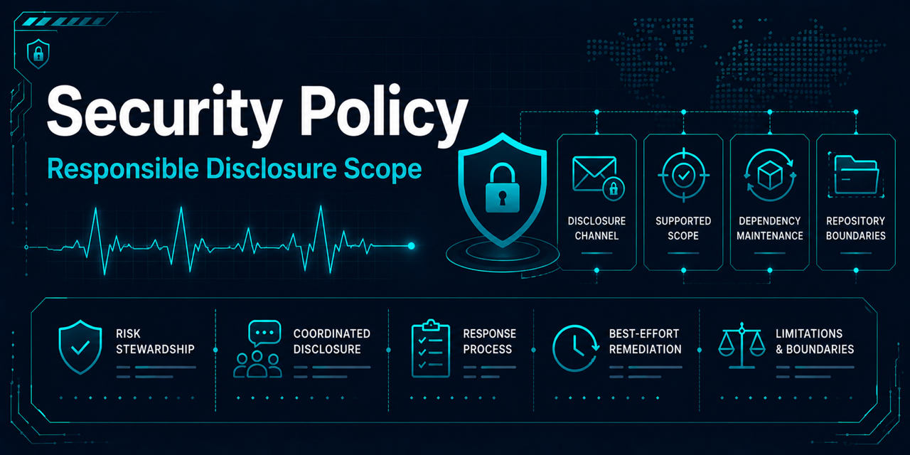

# Security policy

## Scope

This policy covers security issues in the maintained repository content and
supported development workflow, including source code, automation, dependency
configuration, and documentation that could cause unsafe repository use.

This is an educational, research-oriented modernization and reproducibility
case study. It is not production infrastructure, medical software, or clinical
software; it is not intended for healthcare deployment and does not process
patient data in production environments.

## Reporting a vulnerability

Do not open a public issue, discussion, or pull request for an undisclosed
vulnerability. Use GitHub's private
[Report a vulnerability](https://github.com/Jared-Godar/ecg_anomaly_detection/security/advisories/new)
workflow. If that workflow is unavailable, contact `@Jared-Godar` through a
private contact method listed on the maintainer's GitHub profile. In the initial
contact, request a private reporting channel without including exploit details.

Include, when available:

- the affected file, component, branch, tag, or commit;
- a clear description of the issue and its security impact;
- prerequisites and minimal reproduction steps or a proof of concept;
- relevant logs, configuration, or environment details with secrets and
  sensitive data removed;
- known mitigations or suggested remediation; and
- whether the issue has been disclosed to anyone else or has a planned
  disclosure date.

The maintainer will make a best-effort acknowledgement, assess scope and
severity, and provide updates when practical. There is no guaranteed response
or remediation SLA. Timelines depend on severity, complexity, and maintainer
availability.

Keep the report and related details private until the maintainer and reporter
have coordinated disclosure or the maintainer confirms that disclosure is
appropriate. Allow reasonable time for investigation and remediation. The
maintainer may use a GitHub security advisory to coordinate a fix and publish
credit when requested and appropriate.

## Supported versions

| Version or state | Supported |
|---|---|
| `main` | Yes |
| Active tagged release, if present | Yes |
| Historical archive | No |
| Superseded releases | No |
| Modernization branches | No |

Security fixes are targeted to `main` and, when one exists, the active tagged
release. Reports concerning unsupported content are welcome when they identify
a risk to supported content or repository users, but fixes are not guaranteed.

## Dependency maintenance

Dependency updates use the repository's existing Dependabot configuration.
GitHub Actions and pre-commit updates are grouped and checked weekly on Monday
at 09:00 America/New_York. Security updates are prioritized over routine
updates.

Lockfiles are reproducibility artifacts and should remain reviewed and
committed when dependency resolution changes. The supported Python range is
`>=3.12,<3.14`. Dependency upgrades should remain within supported constraints
and preserve deterministic validation behavior.

Repository quality checks and existing `pre-commit`, `gitleaks`, and `zizmor`
references support maintenance, but they do not guarantee that the repository
is free of vulnerabilities.

## Limitations

- This repository has no bug bounty program.
- This repository has no production SLA.
- Remediation is best effort and depends on severity and maintainer
  availability.
- The repository is not operated as a production service or healthcare system.
- Security documentation and automated checks do not constitute a claim of
  production readiness, clinical safety, or fitness for healthcare deployment.

See the [security governance policy](docs/governance/security-policy.md) for the
stewardship and risk-management rationale behind this policy.
