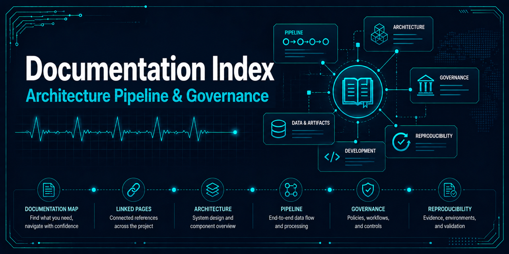

# Documentation guide

The maintained documentation is organized by the question a reader is trying to answer.

| Document | Purpose |
|---|---|
| [Project README](../README.md) | Portfolio overview, current status, quick start, and limitations |
| [Public notebook workflow](../notebooks/README.md) | Canonical 00 → 01 → 02 public workflow covering artifact generation, modernization narrative, and validation-only gradient boosting example. |
| [Environment setup and artifact generation](../notebooks/00-environment-setup-and-artifact-generation.ipynb) | Fresh-clone setup, environment verification, governed artifact generation, and Step 0 readiness evidence. |
| [Narrative walkthrough](../notebooks/01-narrative-walkthrough.ipynb) | Package-backed explanation of the supported modernization workflow and evidence boundaries. |
| [Gradient boosting validation example](../notebooks/02-high-performing-gradient-boosting-validation.ipynb) | Validation-only classical ML example using generated governed artifacts. |
| [High-performing gradient boosting example](high-performing-gradient-boosting-example.md) | Public validation-only classical ML example built on generated pipeline artifacts |
| [Notebook guidance](../notebooks/README.md) | Supported notebook, execution, business-logic, and generated-figure policy |
| [Model card](../MODEL_CARD.md) | Baseline scope, assumptions, evaluation, intended use, and prohibited use |
| [Architecture](architecture.md) | Implemented repository boundaries and target component ownership |
| [Pipeline design](pipeline-design.md) | Proposed lineage, validation controls, run outputs, and cloud mapping |
| [Dataset acquisition](dataset-acquisition.md) | Versioned HTTPS retrieval, idempotency, recovery, and trust boundary |
| [Data integrity](data-integrity.md) | Implemented local file inventory, SHA-256 baseline, and trust boundary |
| [Record validation](record-validation.md) | Implemented WFDB ingestion, validation rules, and report schema |
| [Annotation mapping](annotation-mapping.md) | Versioned binary target policy, exclusions, and audit report |
| [Window extraction](window-extraction.md) | Boundary-safe geometry, lineage-preserving NPZ output, and overlap audit |
| [Record-grouped splitting](record-grouped-splitting.md) | Deterministic partition membership, leakage controls, and split manifest |
| [Split quality reporting](split-quality-reporting.md) | Partition diagnostics, acceptance thresholds, and failure behavior |
| [Run manifests](run-manifests.md) | Git, environment, configuration, dataset, split, and artifact evidence |
| [Reproducibility evidence](reproducibility-evidence.md) | Versioned environment, runtime, resource, and digest evidence |
| [Pipeline orchestration](pipeline-orchestration.md) | One-command local workflow, outputs, failure behavior, and limits |
| [Model-ready dataset](model-ready-dataset.md) | Grouped shard index, lazy-loading contract, and training boundary |
| [Baseline training](baseline-training.md) | Deterministic estimator fitting, train-only isolation, and lineage |
| [Baseline evaluation](baseline-evaluation.md) | Frozen-model validation metrics, isolation, and digest checks |
| [Evaluation policy](evaluation-policy.md) | Development evaluation and protected-test boundaries |
| [Benchmark governance](benchmark-governance.md) | Future benchmark eligibility, execution, disclosure, rerun, and archival rules |
| [Data provenance](data-provenance.md) | Dataset source, license, attribution, privacy, and label provenance |
| [Historical archive attribution](../archive/original_2022/ATTRIBUTION.md) | Per-file attribution status inventory for archived 2022 presentation imagery |
| [Historical archive provenance](../archive/original_2022/PROVENANCE.md) | Attribution audit method and provenance evidence for the archived 2022 project |
| [Historical results](historical-results.md) | Saved 2022 metrics and their known evaluation defects |
| [Development workflow](development.md) | Locked environment, tests, hooks, and CI behavior |
| [Local environment reproducibility](environment-reproducibility.md) | Dependency groups, locked setup commands, interpreter provenance, kernels, and troubleshooting |
| [Modernization roadmap](modernization-roadmap.md) | Completed, active, and planned modernization phases |
| [Governance guide](governance/index.md) | Repository, issue, security, versioning, and release governance |
| [Issue workflow](governance/issue-workflow.md) | Issue intake, triage, status transitions, and project tracking |
| [Label taxonomy](governance/label-taxonomy.md) | Label dimensions, assignment rules, and deterministic bootstrap |
| [GitHub Project governance](governance/github-project.md) | Project fields, workflow states, views, and historical planning record |
| [GitHub metadata automation](governance/github-metadata-automation.md) | Programmatic issue creation and Project V2 backfill approach, and the automated pull-request metadata gate |
| [Repository hygiene automation](governance/repository-hygiene.md) | Label drift detection, held-out execution trigger safety, and the declined stale-issue/PR automation decision |
| [Repository governance](governance/repository-governance.md) | Ownership, pull-request workflow, and enforcement boundaries |
| [Security governance](governance/security-policy.md) | Private reporting, supported versions, dependency stewardship, and limitations |
| [Release governance](governance/releases.md) | Release boundaries, evidence, artifact hygiene, and explicit limitations |
| [Versioning policy](governance/versioning.md) | Semantic version rules and pre-1.0 change disclosure |
| [Release checklist](governance/release-checklist.md) | Review steps for a future, explicitly authorized release |
| [Changelog](../CHANGELOG.md) | Unreleased changes and version history |
| [Contributing](../CONTRIBUTING.md) | Change scope, data safety, validation, and pull request expectations |
| [Third-party notices](../NOTICE.md) | Dataset, dependency, tutorial, and historical asset attribution status |

## Documentation rules

- Describe only tested behavior as implemented.
- Label unbuilt components and cloud services as proposed.
- Present the 2022 model output only as historical evidence with the record-leakage caveat.
- Keep source-dataset attribution and the research/educational-use limitation visible.
- Prefer links to generated evidence once the modern pipeline produces manifests and reports.
- Present public example-notebook metrics only as local validation-only experimentation, not as benchmark, clinical, diagnostic, or production evidence.
