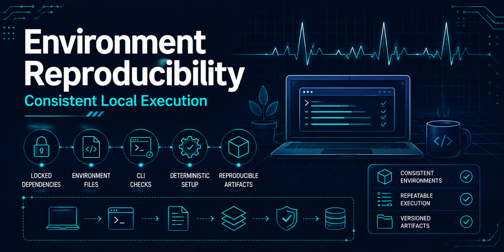

# Local environment reproducibility



## Reproducibility contract

The supported local environments are declared by `pyproject.toml` and resolved exactly by
`uv.lock`. Run commands through `uv`; do not rely on globally installed packages, an IDE-created
interpreter, a stale virtual environment, or packages manually added to `.venv`.

The failures that led to this contract occurred because `uv sync` succeeded, not because it
failed. `uv` correctly removed packages that were absent from the declared dependency graph and
therefore exposed an incomplete environment contract. The dependency groups now make each
supported workflow explicit.

## Supported workflows

Run the smallest command that supports the work being performed:

| Workflow | Command | Declared contents |
|---|---|---|
| Core package and CLI | `uv sync --locked` | Package runtime dependencies (`numpy`, `wfdb`) |
| Repository engineering | `uv sync --locked --dev` | Core plus tests, coverage, type checking, and hooks |
| Supported notebooks | `uv sync --locked --group notebooks` | Core plus IPython, Jupyter, kernel, widget selector, plotting, scikit-learn, and static notebook validation infrastructure |
| Local model experiments | `uv sync --locked --group notebooks --group experiments` | Notebook stack (already includes scikit-learn) plus LightGBM and XGBoost |

The `dev` group must contain repository engineering tools only. Notebook infrastructure belongs in
`notebooks`; optional modeling and playground libraries belong in `experiments`. `nbformat` is the
intentional exception shared by `dev`, where synthetic quality tests require it, and `notebooks`,
where the optional local command requires it. A package belongs in core only when every supported
CLI workflow imports it at runtime. Future packages should be added to the narrowest owning group
with `uv add`, followed by a committed lockfile update.

Locked syncs reconcile `.venv` to the selected groups. A package that happens to exist before a
sync can be removed if it is undeclared or belongs to a group that was not selected. That removal
is expected and prevents local residue from masking missing declarations.

## Validate interpreter and imports

Confirm that commands resolve to this checkout's `.venv` rather than system Python, Homebrew,
Conda, or an IDE-managed interpreter:

```fish
uv run which python
uv run python -c "import sys; print(sys.executable); print(sys.version)"
uv run python -c "import numpy; print('numpy ok')"
uv run python -c "import wfdb; print('wfdb ok')"
```

The executable path must end in this repository's `.venv/bin/python`. Validate optional groups
with the group on every `uv run` command so `uv` selects the intended environment:

```fish
uv run --group notebooks python -c "import IPython, ipykernel, ipywidgets, matplotlib, matplotlib_inline, nbformat, sklearn; print('notebooks ok')"
uv run --group notebooks --group experiments python -c "import lightgbm, xgboost; print('experiments ok')"
```

## Choose a notebook execution location

The first executable section of notebook 00 stores an execution profile used by every later
environment-sensitive cell. VS Code and JupyterLab are interfaces rather than separate execution
locations: when either selects this checkout's `.venv`, use the `local` profile.

| Profile | Choose it when | What notebook 00 does |
|---|---|---|
| `local` (recommended) | The repository is cloned on the user's computer and durable ignored artifacts are useful | Keeps the checkout in place, syncs the locked `notebooks` group into `.venv`, and runs the CLI through `uv run` |
| `codespaces` | A browser-hosted Linux workspace is preferable to local Python setup | Keeps the codespace checkout in place and uses the same locked `.venv` path as local execution |
| `colab` | A disposable hosted trial is acceptable | Clones the public repository into `/content/ecg_anomaly_detection` when absent, exports the locked notebook dependency set, installs it into the active hosted kernel, and invokes the installed CLI directly |

The selector defaults to `auto`: it detects Colab first, then Codespaces, and otherwise selects
local. A visible dropdown can override that choice before continuing. If widgets are unavailable,
set `REQUESTED_EXECUTION_PROFILE` to `local`, `codespaces`, or `colab` and rerun the selector. The
preparation cell rejects a Colab choice outside an actual Colab runtime and refuses to overwrite an
ambiguous existing `/content/ecg_anomaly_detection` path.

The execution profile changes environment and repository-location arguments only. All profiles use
the same tracked dataset, annotation, window, grouped-split, training, and validation-evaluation
configs. Generated source data and run artifacts remain ignored runtime-local files; they are not
committed or benchmark evidence. A Codespaces filesystem can persist across stop/start but is
removed when the codespace is deleted, while a hosted Colab VM and its local files are ephemeral.
Runtime resources and availability can vary, so the notebook's time ranges are qualified planning
guidance rather than guarantees.

Platform references: [VS Code Jupyter kernel selection](https://code.visualstudio.com/docs/datascience/jupyter-kernel-management),
[GitHub Codespaces lifecycle](https://docs.github.com/en/codespaces/about-codespaces/understanding-the-codespace-lifecycle),
and [Google Colab FAQ](https://research.google.com/colaboratory/faq.html).

## Register and select the notebook kernel

After syncing the notebook group, register the current `.venv` once for Jupyter-compatible tools:

```fish
uv run --group notebooks python -m ipykernel install --user --name ecg-anomaly-detection --display-name "Python (.venv: ecg_anomaly_detection)"
uv run --group notebooks jupyter kernelspec list
```

Select `Python (.venv: ecg_anomaly_detection)` in VS Code or another Jupyter-compatible tool.
Kernel discovery only proves that a specification exists. In a notebook, run the following and
confirm that it prints this checkout's `.venv/bin/python`:

```python
import sys

print(sys.executable)
```

If the kernel refers to a deleted or moved checkout, remove and reinstall it:

```fish
uv run --group notebooks jupyter kernelspec remove ecg-anomaly-detection
uv run --group notebooks python -m ipykernel install --user --name ecg-anomaly-detection --display-name "Python (.venv: ecg_anomaly_detection)"
```

## Local notebook boundary

The tracked `notebooks/` directory contains only reviewed, supported notebooks and policy. Scratch
notebooks, local configurations, checkpoints, plots, model files, data, and experiment outputs
belong under the ignored `notebooks/local/` sandbox. They are not supported inputs, reproducibility
evidence, benchmark evidence, or release artifacts. Do not commit `.DS_Store`, notebook
checkpoints, local data, generated artifacts, models, or machine-specific configuration.

## Troubleshooting

- Missing `IPython`, `ipykernel`, `ipywidgets`, `matplotlib`, `matplotlib_inline`, or `sklearn`: sync and run
  with `--group notebooks`; do not install the package globally.
- Missing `lightgbm` or `xgboost`: add `--group experiments` together with the notebook group for
  local playground work.
- Kernel absent from an editor: run `jupyter kernelspec list`, register it again, then reload the
  editor's kernel list.
- Correct kernel name but wrong Python: inspect `sys.executable`; remove the stale kernelspec and
  register it from the current checkout.
- Import succeeds in a terminal but fails in a notebook: the terminal and notebook are using
  different interpreters. Select the registered project kernel rather than system, Homebrew,
  Conda, or an IDE-hidden Python.
- A package disappears after `uv sync`: declare it in the correct group or select its existing
  group. Do not repair the environment with an unrecorded `pip install`.
