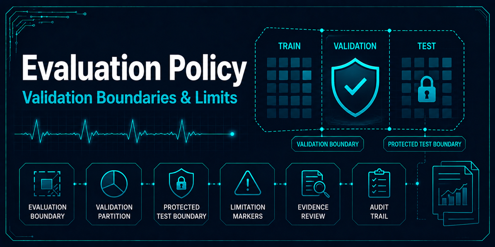

# Evaluation policy

## Supported development evaluation

The implemented evaluator scores only the `validation` partition. Validation evidence supports
pipeline verification and bounded model development. It is not a final benchmark, does not establish
generalization, and must not be presented as clinical evidence.

Training and selection decisions may use training and validation evidence. They must not inspect the
protected `test` partition, its shards, labels, predictions, aggregates, or metrics.

## Protected benchmark evaluation

The `test` partition is reserved for a future, separately reviewed benchmark. Test evaluation is
disabled by default. The repository has no supported held-out benchmark execution command, and the
governance policy does not enable one. Any future implementation must require explicit opt-in and
enforce the eligibility, immutable lineage, approval, rerun, disclosure, and archival controls in
[Benchmark governance](benchmark-governance.md).

No benchmark metrics exist as part of this policy change. Adding test scoring requires a separate
change with synthetic, data-independent tests and review of its access and artifact boundaries.

## Interpretation limits

Evaluation must disclose dataset, annotation, class-imbalance, binary-mapping, grouped-split, and
historical-dataset limitations. Neither validation nor a future benchmark can by itself establish
model quality beyond its stated measures, generalization, clinical validity, or medical utility.
Claims of diagnostic usefulness, healthcare-AI readiness, medical-device suitability, or production
healthcare readiness are prohibited.
