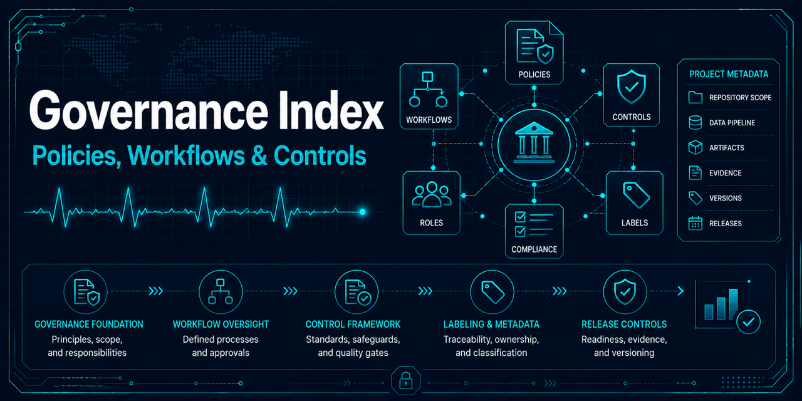

# Governance documentation

Repository governance defines how work is selected, reviewed, maintained, and
prepared for a possible release. These policies document expectations; controls
that depend on GitHub settings remain subject to the enforcement boundaries in
the repository governance policy.

| Document | Purpose |
|---|---|
| [Repository governance](repository-governance.md) | Ownership, pull-request workflow, review, and enforcement boundaries |
| [Issue workflow](issue-workflow.md) | Intake, triage, status transitions, and project tracking |
| [Label taxonomy](label-taxonomy.md) | Label dimensions and assignment rules |
| [GitHub Project governance](github-project.md) | Project fields, lifecycle, views, automation, and historical record |
| [GitHub metadata automation](github-metadata-automation.md) | Programmatic issue creation and Project V2 backfill approach, the automated pull-request metadata gate, and creation-time board population |
| [Repository hygiene automation](repository-hygiene.md) | Label drift detection, board drift detection, and the declined stale-issue/PR automation decision |
| [Security governance](security-policy.md) | Reporting, supported states, dependencies, and security limitations |
| [Release governance](releases.md) | Release purpose, source-archive boundary, evidence, and artifact hygiene |
| [Versioning policy](versioning.md) | Semantic version rules and pre-1.0 compatibility expectations |
| [Release checklist](release-checklist.md) | Review steps for a future, explicitly authorized release |

Release governance does not create a tag, GitHub release, package publication,
or release automation. Any such operation requires separately authorized work.
