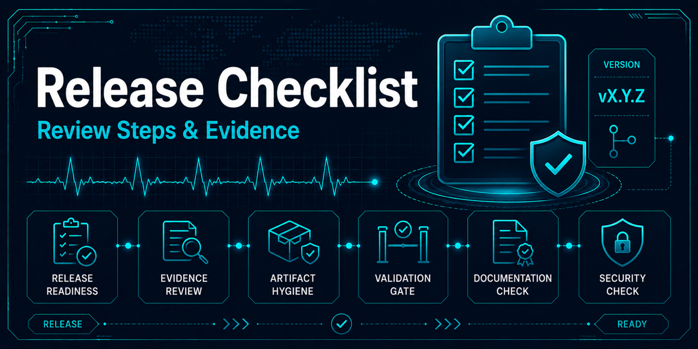

# Release checklist



This checklist prepares and reviews a future release. It does not instruct a
maintainer to publish a package, create a tag, or create a GitHub release unless
those actions are explicitly authorized in separate work.

## Scope and version

- [ ] Confirm the intended release scope is coherent and merged into `main`.
- [ ] Select the version using the [versioning policy](versioning.md).
- [ ] Confirm `pyproject.toml`, the changelog, and draft release notes agree on
  the proposed version.
- [ ] Move relevant `Unreleased` entries under the proposed version without
  inventing a date.
- [ ] Document breaking changes, migrations, compatibility effects, and known
  limitations.

## Content and boundaries

- [ ] Confirm source, tests, configuration, lockfiles, governance documentation,
  changelog, release notes, and reproducibility references are included.
- [ ] Confirm raw and generated datasets, patient-level data, trained models,
  benchmark outputs, local manifests, caches, and temporary files are excluded.
- [ ] Run `git ls-files dist` and confirm built package artifacts are not tracked,
  unless their publication was intentionally approved for this release.
- [ ] Verify the dataset DOI, upstream license, required citations, repository
  MIT license boundary, and third-party notices remain visible.
- [ ] Confirm historical results retain their evaluation caveats and no claim is
  made about generalization to unseen patients.

## Validation evidence

Run only data-independent repository checks; do not acquire data, train a model,
or execute benchmarks as part of release-governance validation.

```fish
uv run pytest
uv run pyright
uv run pre-commit run --all-files
git diff --check
```

- [ ] Record the checks run, their outcomes, and any justified exception.
- [ ] Review the final diff and confirm generated or unrelated files are absent.
- [ ] Confirm a clean checkout can use the documented locked environment before
  making any reproducibility claim.
- [ ] Confirm core, development, notebook, and experiment locked syncs succeed without globally
  installed packages or an IDE-managed interpreter.

## Release communication

- [ ] State that the release is an engineering portfolio artifact.
- [ ] State that it does not imply production readiness, clinical suitability,
  medical utility, or regulatory compliance.
- [ ] Summarize reproducibility guarantees and limitations accurately.
- [ ] Keep package publication, tags, GitHub releases, and automation outside the
  scope unless each action has been explicitly approved and reviewed.
