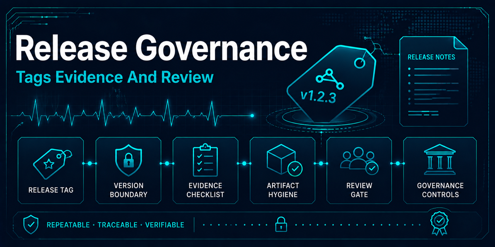

# Release governance

## Purpose and current state

Releases are versioned engineering portfolio artifacts: they provide a stable,
reviewable snapshot of the repository's source, configuration, documentation,
and reproducibility contracts. They are not a distribution channel for data,
models, benchmark results, or medical functionality.

The package metadata is versioned `1.1.0`, tagged as the `v1.1.0` GitHub release.
This policy documents how each release should be reviewed; it does not by
itself authorize a future tag, GitHub release, or package publication -- each
still requires separately authorized work.

A release does not imply production readiness, clinical suitability, medical
utility, or regulatory compliance. This project remains a research, education,
and software-engineering demonstration and must not be used for diagnosis,
monitoring, treatment, or patient-care decisions.

## Release boundary

A future release source archive should include:

- source code and tests;
- versioned configuration;
- dependency and environment lockfiles;
- governance and technical documentation;
- the changelog and release notes; and
- references to the repository's reproducibility policies and evidence model.

It should exclude:

- raw or generated datasets and patient-level data;
- trained models and benchmark outputs;
- local run manifests or other machine-local evidence;
- caches and temporary files; and
- built package artifacts unless publishing those artifacts is an intentional,
  separately reviewed part of that release.

Repository source archives and Python distributions are distinct artifacts.
Creating a GitHub release does not by itself approve publishing a wheel or source
distribution to a package index. Any future package publication requires an
explicitly scoped governance and implementation change.

## Release decision and evidence

The maintainer decides whether a repository state is release-ready after the
[release checklist](release-checklist.md) is complete. The proposed version and
scope must follow the [versioning policy](versioning.md). Release notes should
summarize user-visible changes, compatibility effects, known limitations, and
reproducibility implications without presenting historical or validation-only
metrics as evidence of generalization.

The changelog is prepared continuously, not at release time: every pull
request with substantive changes updates `CHANGELOG.md` under `## Unreleased`
in that same pull request (`AGENTS.md`, "Standing commitments"). This is
mechanically enforced -- the `Enforce per-PR changelog updates` job in
`.github/workflows/metadata-governance.yml` runs
`scripts/github/validate_changelog_update.py`, which fails any pull request
that touches a substantive path (`src/`, `scripts/`, `docs/`, `configs/`, or
`.github/workflows/`) without also touching `CHANGELOG.md`. A pull request
that genuinely needs no entry must say so explicitly and visibly with a
`changelog: not-needed -- <reason>` line in its body; the gate records the
exemption in its output instead of being bypassed silently (issue #184). The
release pull request then only freezes the accumulated `Unreleased` entries
under the proposed version. Tagging and publication remain separate,
deliberate operations and must not occur as an incidental effect of merging a
governance change.

## Artifact hygiene

The root `.gitignore` excludes `dist/`, so locally built wheels and source
distributions remain outside version control. A release review must use
`git ls-files dist` to confirm that built artifacts have not been committed. If
they are tracked in the future, remove them from Git in a reviewed change and
retain an ignore policy; do not delete local artifacts blindly.

`.github/workflows/quality.yml`'s `package-build` job runs this same
confirmation automatically on every pull request, alongside a build-only
`uv build` assurance check (wheel and source distribution) that never
uploads or publishes anywhere. This is a data-independent quality check per
the [modernization roadmap](../modernization-roadmap.md) Phase 6, not a
release action; it does not create a tag, GitHub release, or package
publication, and does not change this policy's separately-reviewed
publication requirement above.

Raw data, derived patient-level data, trained models, generated reports, and
local manifests remain governed by the repository's existing data and artifact
boundaries regardless of release status.
