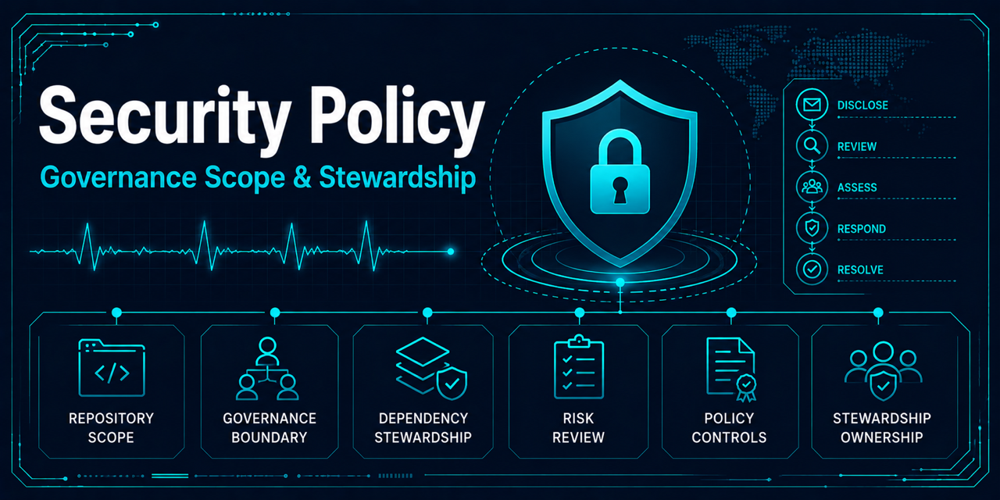

# Security governance policy

## Purpose and stewardship

Security governance in this repository supports responsible stewardship of a
public, MIT-licensed educational project. Its purpose is to give contributors
and researchers a private reporting path, define which repository states receive
maintenance, and make dependency decisions auditable. These controls reduce
avoidable risk and maintenance ambiguity; they do not establish production or
healthcare security assurances.

The repository is a research-oriented modernization and reproducibility case
study based on a historical ECG machine-learning project. It is not production
infrastructure, medical software, or clinical software. It is not intended for
healthcare deployment and does not process patient data in production
environments.

The root [security policy](../../SECURITY.md) is the authoritative reporter-facing
summary. This document explains how that policy supports repository maintenance.

## Reporting and coordinated disclosure

Potential vulnerabilities should be reported through GitHub's private
[Report a vulnerability](https://github.com/Jared-Godar/ecg_anomaly_detection/security/advisories/new)
workflow, not through a public issue, discussion, or pull request. If the private
workflow is unavailable, the reporter should use a private contact method on
`@Jared-Godar`'s GitHub profile to request a secure channel without initially
sharing exploit details.

A useful report identifies the affected file, component, branch, tag, or commit;
describes impact and prerequisites; provides minimal reproduction steps or a
proof of concept; supplies sanitized logs or environment details; and notes
possible mitigations and any existing or planned disclosure. Reports must not
include secrets, private data, or patient-level data.

The maintainer will make a best-effort acknowledgement and assessment, then
communicate material updates when practical. No acknowledgement or remediation
deadline is guaranteed. Severity, exploitability, remediation complexity, and
maintainer availability determine prioritization. The reporter and maintainer
should keep details private until disclosure is coordinated or the maintainer
confirms that public disclosure is appropriate.

There is no bug bounty program and no production SLA.

## Support boundary

| Version or state | Supported | Rationale |
|---|---|---|
| `main` | Yes | Authoritative maintained repository state |
| Active tagged release, if present | Yes | Current published release state |
| Historical archive | No | Preserved evidence, not maintained software |
| Superseded releases | No | Replaced by the active maintained state |
| Modernization branches | No | Temporary development work, not a support target |

Fixes should normally land on `main` and be applied to an active tagged release
when one exists and is affected. Unsupported content may still inform a fix when
it exposes supported users or maintained code to risk, but the policy does not
promise remediation of archived or superseded states.

## Dependency risk management

The existing Dependabot configuration manages GitHub Actions and pre-commit
dependencies. Updates for both ecosystems are grouped weekly and scheduled for
Monday at 09:00 America/New_York. Security updates take priority over routine
maintenance updates, while still receiving review and repository validation.
Dependabot pull requests pass the same required merge gates as human-authored
changes — their changelog entries and board metadata are supplied by governed
automation rather than gate exemptions; see [bot-authored pull
requests](github-metadata-automation.md#bot-authored-dependabot-pull-requests)
for the policy and the automation's security model.

The project supports Python `>=3.12,<3.14`. Dependency changes should respect
that range, retain lockfiles as reviewed reproducibility artifacts, and preserve
deterministic validation behavior. An urgent version change is not complete
merely because it resolves an advisory: its lockfile change and validation
effects must remain inspectable.

Existing repository references to `pre-commit`, `gitleaks`, `zizmor`, and the
repository quality workflow provide layered maintenance checks. These tools
help detect classes of defects; they are not proof that the repository is secure
or suitable for production use.

## Maintainability and review

Security work follows the normal repository governance model: changes are
scoped, reviewed, validated, and documented before reaching `main`. Reports
should be triaged according to demonstrated impact on supported content rather
than according to the medical subject matter of the historical dataset.

Policy changes should remain consistent with the
[repository governance policy](repository-governance.md), development workflow,
and reproducibility requirements. Maintainers should revisit the reporting path,
support table, Python range, and dependency automation when release practices or
repository ownership change.

## Explicit limitations

- Remediation timelines are best effort and depend on severity and maintainer
  availability.
- The repository is not operated as production infrastructure.
- The repository does not provide medical or clinical functionality.
- The repository is not intended for healthcare deployment.
- The repository does not process patient data in production environments.
- Repository checks, maintenance practices, and this policy make no claim of
  production readiness, clinical safety, regulatory compliance, or complete
  vulnerability coverage.
