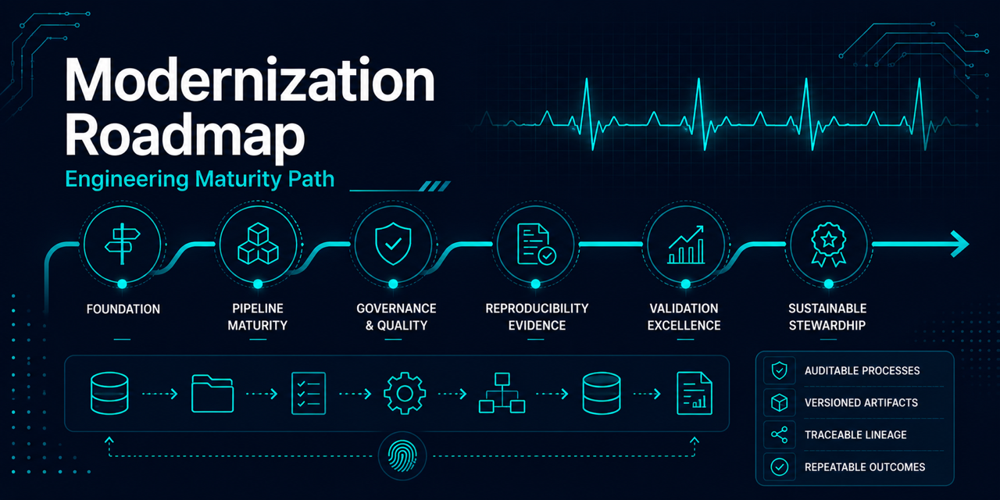

# Modernization roadmap

The work is intentionally incremental so that the original project remains inspectable while each
replacement gains tests and documentation. Checkboxes report repository state, not aspirations.

## Phase 1 — MVP documentation

- [x] Reframe the repository as a historical project under modernization.
- [x] Add research-only and non-clinical use limitations.
- [x] Separate historical outputs from validated claims.
- [x] Document dataset provenance, license, and citations.
- [x] Record known leakage, metric, attribution, and reproducibility risks.

## Phase 2 — Reproducible environment

- [x] Select Python 3.12 and `uv` as the supported environment workflow.
- [x] Add `pyproject.toml`, development dependencies, and a lock file.
- [x] Separate locked core, engineering, notebook, and optional experiment environments.
- [x] Replace absolute paths with configuration in the supported workflow.
- [x] Add repeatable dataset retrieval from the authoritative source.
- [x] Add expected-file inventory and local SHA-256 integrity checks.
- [x] Pin repository-reviewed source sizes and SHA-256 hashes before acquisition installation.
- [x] Define raw, external, interim, processed, report, and artifact locations.

Exit criterion: a contributor can create the environment and run documented, configuration-driven
data access with synthetic CI coverage. Complete.

## Phase 3 — Notebook cleanup

- [x] Maintain the original notebooks in the dated `archive/original_2022/` bundle.
- [x] Identify one canonical package-backed narrative notebook.
- [x] Keep the canonical notebook free of duplicated pipeline implementation; no other curated
  notebook exists.
- [x] Keep the canonical notebook free of saved outputs and execution errors.
- [x] Attribute third-party imagery.

The canonical walkthrough has a documented order and purpose, loads package-owned contracts, and
degrades cleanly without local ignored evidence. The historical third-party imagery attribution
audit is complete: see
[`archive/original_2022/ATTRIBUTION.md`](../archive/original_2022/ATTRIBUTION.md). Archived images
are preserved unchanged per the archive's preservation policy, so imagery is attributed where a
source could be established rather than replaced; provenance that could not be established is
disclosed explicitly instead of left silent.

## Phase 4 — Pipeline refactor

- [x] Create an installable `src` package boundary.
- [x] Separate acquisition, validation, windowing, splitting, training, and evaluation.
  Evaluation is intentionally limited to validation; test evaluation remains protected.
- [x] Retain record identifiers through current inventory, ingestion, mapping, and window stages.
- [x] Add explicit record-to-subject metadata and subject-disjoint split schema v2.
- [x] Index grouped model-ready record shards with content digests and aggregate counts.
- [x] Introduce a configuration-driven command-line entry point.
- [x] Write auditable run manifests for current data-stage evidence.
- [x] Write machine-readable validation metrics with artifact digests.
- [x] Generate versioned environment, runtime, resource, and artifact-digest evidence for each run.

The supported data stages now run through one configuration-driven local orchestration command and
produce a grouped model-ready dataset index.

Exit criterion: the pipeline can be run without editing source files and produces traceable outputs.

## Phase 5 — Testing and validation

- [x] Add synthetic fixtures that do not redistribute source ECG data.
- [x] Test sample-rate, shape, boundary-window, and label-mapping behavior.
- [x] Assert that records never cross split boundaries.
- [x] Assert that subjects never cross split boundaries, including multi-record synthetic fixtures.
- [x] Report deterministic split quality and enforce configurable warning/failure thresholds.
- [x] Test confusion-matrix and metric calculations.
- [x] Add a small end-to-end test for all currently supported data stages.

Exit criterion: core transformations, split integrity, and metrics have automated regression coverage.

## Phase 6 — CI/CD

- [x] Run formatting, linting, security checks, and tests in CI.
- [x] Add Pyright Basic static type checking for source and tests.
- [x] Validate curated notebooks without downloading the complete dataset.
- [x] Add dependency updates and secret scanning.
- [x] Build documentation or package artifacts without automatic external publication.

Exit criterion: every proposed change receives automated, data-independent quality checks.

## Phase 7 — Portfolio polish

**v1.0.0 scope versus post-1.0 roadmap:** the repository has shipped its [`v1.0.0`
release](https://github.com/Jared-Godar/ecg_anomaly_detection/releases/tag/v1.0.0). Every claim in
`README.md`, `MODEL_CARD.md`, and `docs/*` was audited against generated evidence and code behavior
before the release (#71); held-out evaluation was intentionally scoped out of v1.0.0 and tracked
separately in `M9 — Held-out Evaluation`. It was completed post-1.0 under its own governance rather
than silently folded into the earlier release.

- [x] Document repository architecture and proposed data lineage.
- [x] Define and execute a separately reviewed held-out evaluation protocol. **Completed
  post-1.0**, not a v1.0.0 blocker: the eligibility, access, lineage, rerun, disclosure, and archival
  governance this requires is already defined (next item), but forcing the single irreversible,
  governance-gated protected-test execution itself against a release milestone would contradict
  that governance's own deliberate gating. Tracked in the `M9 — Held-out Evaluation` milestone
  (#72, #73). v1.0.0 shipped before this work; the aggregate post-1.0 record is documented in
  [held-out evaluation](held-out-evaluation.md).
- [x] Publish a validation-only model card covering assumptions, evidence boundaries, limitations,
  intended use, and prohibited use without implying that a held-out benchmark exists.
- [x] Define benchmark eligibility, protected-test access, lineage, rerun, disclosure, and archival
  governance before held-out execution.
- [x] Document runtime, resource evidence, and operational interpretation limits.
- [x] Describe future-state cloud concerns without claiming implementation.
- [x] Review every model and pipeline claim against generated evidence.

Exit criterion: the repository demonstrates senior-level data engineering judgment without implying production or clinical readiness.
