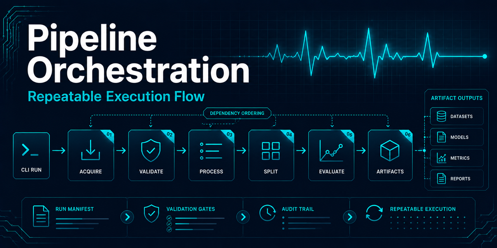

# Local pipeline orchestration



## Scope

The supported orchestration command connects the implemented data stages through one
configuration-driven workflow. It acquires and inventories the configured dataset, validates every
record, maps annotations, extracts windows, assigns complete records to grouped partitions, and
writes an auditable run manifest, fits a deterministic training-only baseline, and evaluates the
frozen model on validation shards only.

The workflow does not open or report the indexed test partition. Validation metrics are exploratory
pipeline evidence and do not establish final model quality or clinical suitability.

## Run the supported workflow

From the repository root:

```fish
uv run ecg-data run-pipeline \
  --repository-root . \
  --dataset-config configs/mitdb-v1.0.0.toml \
  --mapping-config configs/annotation-map-v1.toml \
  --window-config configs/windowing-v1.toml \
  --split-config configs/splitting-v2.toml \
  --training-config configs/training-baseline-v1.toml \
  --evaluation-config configs/evaluation-baseline-v1.toml
```

The first run retrieves the configured source files. Later runs verify and reuse the acquisition
baseline instead of redownloading unchanged files.

## Progress output

`run-pipeline` prints a start and completion banner for each of its seven reported stages
(acquisition, inventory, record processing, split, split diagnostics, training, validation
evaluation), with elapsed time and key counts or artifact paths on completion. The record-processing
stage additionally prints one indented line per record so long record loops do not appear frozen.
Representative output:

```text
run 32888ee3-7781-4171-b43e-e076a73b363c starting
[1/7] acquisition: starting (3 records, 9 files expected)
[1/7] acquisition: complete in 00:04 (manifest written to artifacts/datasets/synthetic/1.0.0/acquisition.json)
[2/7] inventory: starting
[2/7] inventory: complete in 00:01 (9 files verified)
[3/7] record_processing: starting (3 records)
    record 1/3 (100): 3 windows
    record 2/3 (101): 3 windows
    record 3/3 (102): 3 windows
[3/7] record_processing: complete in 00:02 (9 windows across 3 records)
...
completed run 32888ee3-7781-4171-b43e-e076a73b363c in 00:09: 3 records, 9 windows, manifest artifacts/runs/32888ee3-7781-4171-b43e-e076a73b363c/run-manifest.json
```

A stage that raises prints `failed after MM:SS` instead of `complete in MM:SS`; the underlying
error still propagates and the command still returns a nonzero status. This output is purely
observational: it never affects run identity, evidence contents, or artifact schemas, and the
existing `runtime_summary.json` per-stage timings (see below) remain the authoritative timing
evidence.

Every other standalone subcommand except `list-runs` and `purge-run` prints the same shape of
banner around its own single-stage body: a `[1/1] <command>: starting` line, its existing
completion message, then a `[1/1] <command>: complete in MM:SS` (or `failed after MM:SS`) line.
See each stage's own documentation page for its exact output. `list-runs` and `purge-run` are
near-instantaneous local filesystem operations and do not print progress banners.

Every line is flushed as it is written. Python fully block-buffers stdout when it is not a
terminal, which is exactly the case for `notebooks/00-environment-setup-and-artifact-generation.ipynb`'s
Step 0 cell: it runs this command through `subprocess.Popen` specifically so a reviewer can watch
progress live. Without an explicit flush per line, every banner above would arrive in one batch at
process exit instead of live. The notebook requires no changes to pick up this output — it already
streams the CLI's combined stdout/stderr line by line. Before starting, Step 0 also gives a broad,
qualified first-run expectation and names download speed, cache state, record count, CPU, and disk
as variable factors; its measured completion line is runtime feedback, not benchmark evidence.

## Output layout

Each invocation receives a UUID and creates isolated ignored output directories:

```text
artifacts/
├── datasets/<dataset>/<version>/acquisition.json
└── runs/<run-id>/
    ├── inventory.json
    ├── validation/<record-id>.json
    ├── mapping/<record-id>.json
    ├── windows/<record-id>.json
    ├── split.json
    ├── split_quality_summary.json
    ├── environment_summary.json
    ├── runtime_summary.json
    ├── resource_summary.json
    ├── evidence_manifest.json
    ├── training/
    │   ├── model.json
    │   └── training-metadata.json
    ├── evaluation/
    │   └── validation-metrics.json
    └── run-manifest.json

data/interim/runs/<run-id>/
└── windows/<record-id>.npz

data/processed/runs/<run-id>/
└── dataset-index.json
```

The evidence summaries capture the host and interpreter, Git and lockfile identity, stage timings,
best-effort host resources, and artifact digests. The final run manifest hashes every configuration,
evidence summary, report, window artifact, processed dataset
index, fitted model, training metadata, and validation metrics. The split manifest retains record
membership;
individual NPZ artifacts retain row-level record and annotation lineage. Only training shards are
opened by fitting, and only validation shards are opened by evaluation. Test descriptors are not
resolved, opened, scored, summarized, or reported.

This operational evidence supports reproducibility review. It does not prove generalization,
clinical validity, or medical utility. Validation metrics remain validation-only, and held-out
benchmark evaluation remains intentionally protected. Runtime and resource observations may vary
by host environment and system load.

## Local artifact lifecycle helpers

Iterative local runs accumulate `artifacts/runs/<run-id>/`, `data/interim/runs/<run-id>/`, and
`data/processed/runs/<run-id>/` directories, since [run directories are never reused or
overwritten](#execution-and-failure-behavior). `list-runs` and `purge-run` give an operator an
explicit way to inspect and reclaim that local disk space without touching governed, create-only
artifacts:

```fish
uv run ecg-data list-runs --repository-root .
uv run ecg-data purge-run --repository-root . --run-id <run-id> --dry-run
uv run ecg-data purge-run --repository-root . --run-id <run-id>
```

`list-runs` reports each run's ID, total size, directory count, and whether `run-manifest.json`
exists, newest first. `purge-run` removes exactly the three companion directories for one named
run ID — never `data/raw/`, never `artifacts/datasets/<dataset>/<version>/acquisition.json` (the
shared dataset acquisition baseline, which is not run-scoped), and never another run's
directories. `--dry-run` reports what would be removed and the bytes that would be freed without
deleting anything. A run ID must be a canonical lowercase UUID and must resolve to at least one
existing directory, or the command fails with a nonzero exit rather than silently doing nothing.

This is deliberately manual and explicit, not automatic cleanup: nothing here changes the
`run-pipeline` retry behavior described below, and it does not touch the acquisition baseline that
[dataset retrieval](dataset-acquisition.md) verifies and reuses across runs.

## Execution and failure behavior

Records are processed sequentially in configured order. This favors deterministic evidence and
bounded memory use over local parallelism. Each record's signal arrays are released before the next
record is loaded.

Run directories are never reused or overwritten. If a later stage fails, its partial UUID directory
remains available for diagnosis and the command returns a nonzero status. A retry creates a new run
ID while reusing only the verified dataset acquisition baseline. Automatic deletion is intentionally
avoided because it would remove useful failure evidence.

All configuration must be committed under `configs/`. Generated raw, interim, and artifact files
remain ignored. The automated end-to-end test writes three tiny synthetic WFDB records and replaces
the network transport; CI never downloads MIT-BIH data.

## Current limitations

- The workflow is local and sequential; no cloud orchestrator is implemented.
- The model-ready index references record shards rather than concatenating arrays.
- The v1 split balances record counts, not target distributions.
- Test-partition evaluation, model selection, and model-card generation remain unimplemented.

## Channel contract during artifact generation

The governed pipeline depends on window artifacts whose channel identity is explicit and consistent. During artifact generation, the public window configuration selects `MLII` by channel name instead of relying on positional index `0`.

This matters because some datasets may not expose the same signal identity at the same positional index for every record. The pipeline therefore treats mixed resolved channel identities as a data-contract failure. That failure is expected to stop model-ready artifact generation rather than producing a dataset index over inconsistent shards.

A successful pipeline run must produce model-ready artifacts only after the window extraction and shard identity contracts are satisfied, including:

- `data/processed/runs/<run-id>/dataset-index.json`;
- `artifacts/runs/<run-id>/split.json`;
- `artifacts/runs/<run-id>/split_quality_summary.json`; and
- `artifacts/runs/<run-id>/run-manifest.json`.

A clean failure message is useful diagnostics, but it is not equivalent to successful artifact generation. Notebook workflows that depend on these artifacts remain blocked until the governed pipeline produces them.
