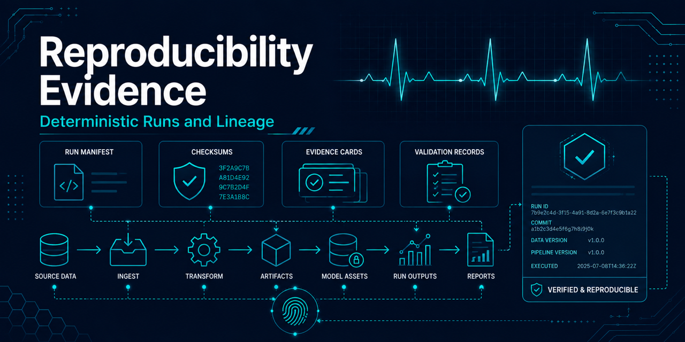

# Reproducibility evidence

## Purpose and boundaries

Each supported pipeline run writes machine-readable operational evidence under its ignored
`artifacts/runs/<run-id>/` directory. The evidence supports review of the code, environment,
configuration, split, artifacts, elapsed time, and host resources associated with a run.

This evidence does not prove generalization, clinical validity, or medical utility. Validation
metrics remain validation-only pipeline evidence. The held-out test partition is intentionally not
opened, evaluated, summarized, or published by this workflow.

## Evidence files

All documents use schema version 1, deterministic key ordering, two-space indentation, and a final
newline.

- `environment_summary.json` records the operating system, architecture, Python runtime, optional
  `uv` version, `uv.lock` identity, and best-effort Git commit, branch, and dirty state.
- `runtime_summary.json` records elapsed seconds for acquisition, record validation, annotation
  mapping, window extraction, splitting, split diagnostics, training, validation evaluation, and
  total elapsed pipeline time through runtime-summary capture.
- `resource_summary.json` records the CPU model, logical core count, total memory, and filesystem
  capacity and utilization when the host exposes them.
- `evidence_manifest.json` records the split identity and SHA-256 evidence for configuration files,
  operational reports, reproducibility summaries, derived artifacts, the fitted baseline, and
  validation metrics.

The evidence manifest does not hash itself, avoiding a circular digest. The existing
`run-manifest.json` hashes the evidence manifest and the three summary documents.

## Availability and interpretation

Optional platform and tool values are `null` when collection is unsupported or fails. Missing
optional metrics do not fail an otherwise valid pipeline run. Contract violations such as an
output outside `artifacts/`, a symbolic link, a duplicate input, or a missing required lockfile do
fail evidence generation.

Runtime and resource values vary by host, operating system load, filesystem, and whether acquisition
reuses verified local files. They are operational observations, not deterministic performance
benchmarks. Generated evidence, raw data, derived data, trained models, and reports remain ignored
and must not be committed.

## Channel identity evidence

Window extraction records channel selector provenance and resolved channel identity in generated artifacts. The model-ready dataset index validates that referenced shards share one channel identity before indexing them for downstream training or validation examples.

This evidence supports reproducibility and lineage review. It is not a clinical, diagnostic, production-readiness, or benchmark claim.
