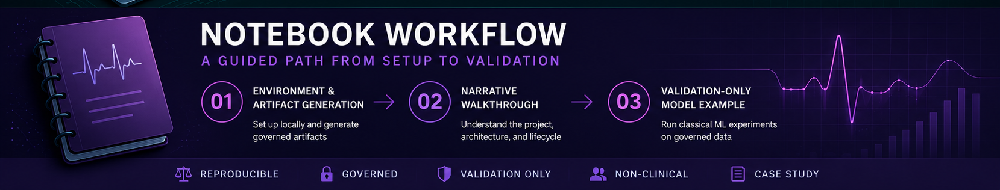

# Notebooks



This directory uses a small, ordered public notebook workflow.

## Recommended order

| Step | Notebook | Purpose |
|---:|---|---|
| 0 | [`00-environment-setup-and-artifact-generation.ipynb`](./00-environment-setup-and-artifact-generation.ipynb) | Fresh-clone setup, environment verification, local artifact preflight, governed pipeline execution, and remediation guidance. |
| 1 | [`01-narrative-walkthrough.ipynb`](./01-narrative-walkthrough.ipynb) | Supported modernization narrative: architecture, data lifecycle, governance, reproducibility, and repository positioning. |
| 2 | [`02-high-performing-gradient-boosting-validation.ipynb`](./02-high-performing-gradient-boosting-validation.ipynb) | Streamlined validation-only gradient boosting example using generated Step 0 artifacts. |

## Boundary

Generated datasets, processed indexes, run manifests, metrics, and trained models are local artifacts and should remain ignored by Git unless a future issue explicitly changes that policy.

These notebooks do not establish clinical, diagnostic, production, deployment, or benchmark evidence.

## Validation

`.github/workflows/notebook-validation.yml` runs `scripts/validate_curated_notebooks.py` on every
pull request, executing all three curated notebooks above end to end in an isolated `git worktree`
copy of the repository. The copy is seeded with a small synthetic WFDB record set and a matching
acquisition manifest, so `acquire_dataset` takes its existing verify-and-reuse path and the real
MIT-BIH dataset is never downloaded. This is genuine cell-by-cell execution of the real, unmodified
notebooks — distinct from `scripts/notebook_quality.py`'s structural/hygiene-only check
(`ecg-data check-local-notebooks`), which validates notebook JSON and metadata without executing
any cell.

```fish
uv run python scripts/validate_curated_notebooks.py
```

Pass `--keep-worktree` to copy the isolated worktree to `.notebook-validation-worktree/` (gitignored)
before it is removed, for inspecting a local failure.
